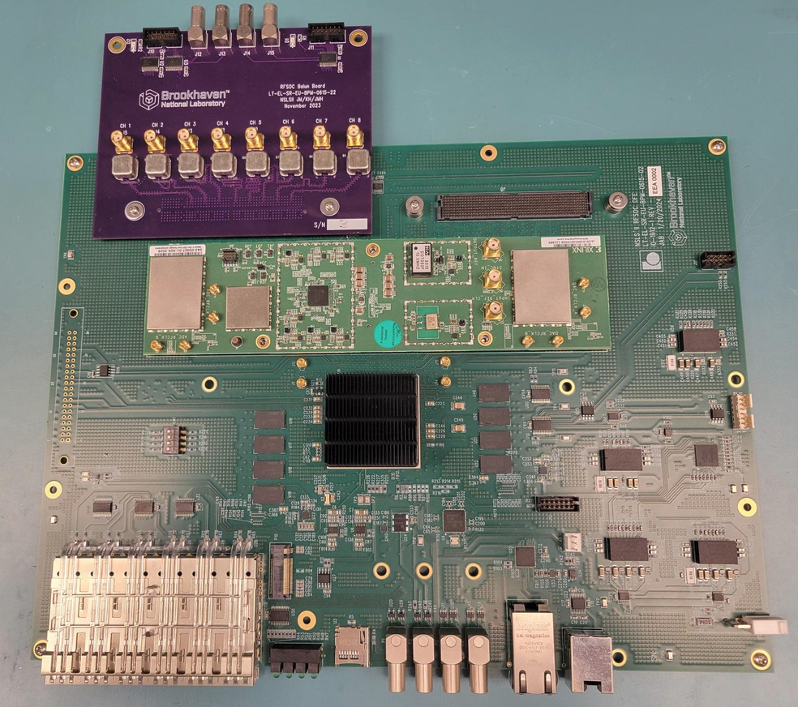
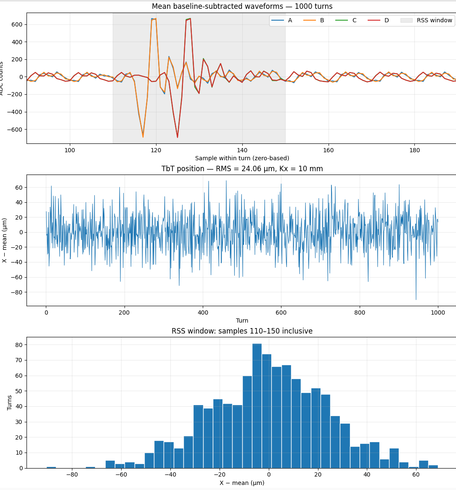

# RFSoC Button Signal Acquisition and Turn-by-Turn Resolution

RFSoC ADC data collected from NSLS-II button signals during normal **500 mA operations**. Measurements include the full fill pattern and a dedicated camshaft bunch capture.

The approximate camshaft bunch current is **0.2 mA**, corresponding to **0.528 nC** at a revolution frequency of 378,545 Hz.


## Hardware Platform

The measurements were performed using an **NSLS-II-developed RFSoC platform** based on the **Xilinx Zynq UltraScale+ RFSoC Gen 3 ZU47DR**. The board uses the same type of RF connectors as the **ZCU208 evaluation board**.

| Component | Specification |
|---|---|
| RFSoC device | Xilinx Zynq UltraScale+ RFSoC Gen 3 ZU47DR |
| RF-ADCs | 8 channels, 14-bit resolution, up to 5 GS/s |
| RF-DACs | 8 channels, 14-bit resolution, up to 10 GS/s |
| RF connectors | Same type as the ZCU208 evaluation board |
| Platform developer | NSLS-II Diagnostics Group, Brookhaven National Laboratory |




## Acquisition Parameters

| Parameter | Value |
|---|---|
| Digitizer | RFSoC |
| ADC sampling rate | 4.9968 GS/s |
| ADC sample interval | Approximately 200 ps |
| ADC channels | Four: A, B, C, D |
| Stored beam current | 500 mA |
| Approximate camshaft bunch current | 0.2 mA |
| Approximate camshaft bunch charge | 0.528 nC |
| Camshaft measurement configuration | Combined-and-split button signal |
| Analog low-pass filter | 2.2 GHz |
| DMA samples per turn per channel | 240 |
| DMA capture window per turn | Approximately 48 ns |
| DMA turns per acquisition | 1,000 |
| Horizontal position coefficient, Kx | 10 mm |

The DMA capture records a short window around the camshaft bunch on each consecutive turn. The 240 samples represent this acquisition window, rather than an entire revolution.

## Files

| File | Description |
|---|---|
| [adc_allbuckets_3turns.txt](adc_allbuckets_3turns.txt) | ADC FIFO capture covering approximately three turns of the full fill pattern. |
| [adc_camshaftbucket_combined-split-2.2Ghz_LPF.txt](adc_camshaftbucket_combined-split-2.2Ghz_LPF.txt) | Four-channel camshaft bunch DMA capture using the combined-and-split signal configuration and a 2.2 GHz low-pass filter. |
| [calc_tbt_noise.py](calc_tbt_noise.py) | Calculates turn-by-turn position variation using baseline-subtracted RSS amplitudes and plots the mean waveforms, position history, and position histogram. |
| [collect_adcdma_data.py](collect_adcdma_data.py) | Collects ADC DMA waveform data and saves it to a text file. |
| [collect_adcfifo_data.py](collect_adcfifo_data.py) | Collects ADC FIFO waveform data and saves it to a text file. |
| [plot_adc.py](plot_adc.py) | Reads and plots ADC waveform data. |
| [single_bunch_resolution_2.2GHz_LPF.png](single_bunch_resolution_2.2GHz_LPF.png) | Single-bunch turn-by-turn position resolution results with the 2.2 GHz low-pass filter. |

## Data Format

The ADC text files contain four whitespace-separated columns:

| Column | Channel |
|---|---|
| 1 | A |
| 2 | B |
| 3 | C |
| 4 | D |

For the DMA capture, each consecutive block of **240 rows** represents one turn. A 1,000-turn acquisition therefore contains **240,000 rows**.

Samples are expressed in ADC counts. Lines beginning with `#` are comments or column headers.

## Turn-by-Turn Analysis

For each turn and channel:

1. Calculate the baseline from samples **0–99**.
2. Subtract that baseline from the waveform.
3. Calculate the root-sum-square (RSS) amplitude over samples **110–150 inclusive**.

All sample indices are zero-based.

```text
S = sqrt(sum((ADC[n] - baseline)^2))
```

Using the resulting channel amplitudes A, B, C, and D, calculate horizontal position:

```text
X = Kx × ((A + D) - (B + C)) / (A + B + C + D)

Kx = 10 mm
```

The reported TbT RMS is the sample standard deviation of the 1,000 position values about their mean. No detrending or channel gain correction is applied.

## Single-Bunch Resolution



The measured variation characterizes the complete acquisition and processing chain for this signal configuration. Interpretation as electronics-only resolution depends on how effectively the combined-and-split setup rejects beam and source fluctuations.

## Running the Analysis

Install the Python dependencies:

```bash
python3 -m pip install numpy matplotlib
```

Calculate and plot the turn-by-turn position variation:

```bash
python3 calc_tbt_noise.py adc_camshaftbucket_combined-split-2.2Ghz_LPF.txt
```

Keep the data files, scripts, and PNG in the same directory as this README.
