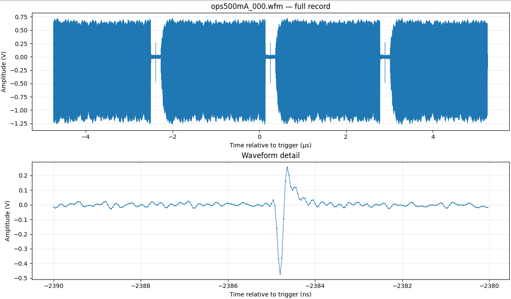
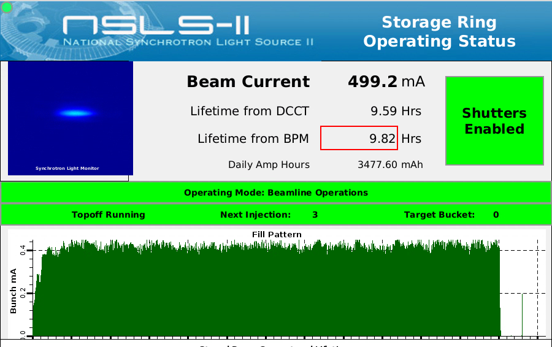

# NSLS-II Button Signal at 500 mA

Data collected from an NSLS-II beam position monitor button signal during normal **500 mA operations**, using a Tektronix oscilloscope.

The approximate camshaft bunch current was **0.2 mA**, corresponding to a bunch charge of **0.528 nC**.

## Acquisition Parameters

| Parameter | Value |
|---|---|
| Instrument | Tektronix oscilloscope |
| Stored beam current | 500 mA |
| Approximate camshaft bunch current | 0.2 mA |
| Approximate camshaft bunch charge | 0.528 nC |
| Sampling rate | 25 GS/s |
| Sample interval | 40 ps |
| Record length | 250,000 samples |
| Acquisition duration | 10 µs |
| Waveform file | `ops500mA_000.wfm` |

The bunch charge is calculated using the revolution frequency of 378,545 Hz:

Q = I / f_rev = 0.0002 A / 378,545 Hz ≈ 0.528 nC

## Button Signal Waveform

## Fill Pattern

